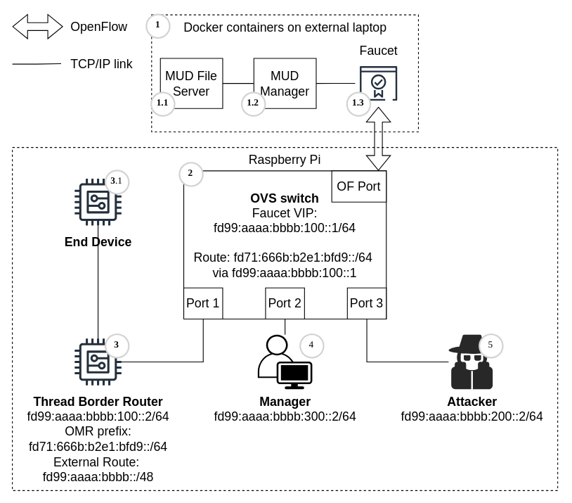

# MeshGuard
This repository provides a detailed description on how to deploy and configure MeshGuard for various scenarios.
## Prerequisite Repositories
To deploy MeshGuard, we require multiple repositories. These should be cloned in the parent directory of this repository.
To setup the Faucet/MUDManager:
```
├── faucet              Cloned from [faucet](https://anonymous.4open.science/r/faucet-CA68/README.rst)
├── faucet-config       This repo
├── OpentThread         Cloned from [OpenThread](https://anonymous.4open.science/r/openthread-4629/README.md)
├── Border Router       Cloned from [Border Router](https://anonymous.4open.science/r/ot-br-posix-544C/README.md)
└── mud-manager         Cloned from [mud-manager](https://anonymous.4open.science/r/mud-manager-5CDF/README.md)

```
## Depolyment Architecture
In the following, we provide an example of the MeshGuard on how to deploy it for testing and executing experiments:



1. The MUD-related components and the SDN controller are deployed in the docker container, where the code for the SDN controller is in this repository.
    1. The MUD File Server is specified in the Docker Compose file, and if the script `run_demo.sh` is executed, it will enable the MUD File server.
    2. The MUD Manager is specified in the Docker Compose file, and the implementation is in the <a href="https://anonymous.4open.science/r/mud-manager-5CDF/README.md" target="_blank" rel="noopener noreferrer">repository</a>.
    3. The faucet is the SDN controller to update the access control policies on the OVS Switches, which are deployed on the Thread Border router and communicate over OpenFlow, <a href="https://anonymous.4open.science/r/faucet-CA68/README.rst" target="_blank" rel="noopener noreferrer">SDN-controller-repository</a>.
2. The Border Router and the OVS Switch are deployed on the Raspberry PI and receive all the updates (<a href="https://anonymous.4open.science/r/ot-br-posix-544C/README.md" target="_blank" rel="noopener noreferrer">Border Router</a>).
3. Thread Border router contains the MUD Forwarder Service.
    1. MTD End Device: we provide installation and flashing instructions for the nRF52840 or nRF52833 to act as MTD <a href="https://anonymous.4open.science/r/mt-cli-C008/README.md" target="_blank" rel="noopener noreferrer">here</a>.
    2. FTD End Device: we provide installation and flashing instructions for the nRF52840 or nRF52833 to act as FTD <a href="https://anonymous.4open.science/r/mt-cli-C008/README.md" target="_blank" rel="noopener noreferrer">here</a>.
4. Manager only added for demonstration for multiple roles in the MUD-specific policies.
5. Attacker only for the demonstration.

To run the demo environment, build the Docker container image for the border router. Be sure to update the name of the image in the `./scripts/run_demo.sh` script with your name.

The directory structure of this repo is as follows:
```
.
├── docker              Contains docker overrides for Faucet as well as the MUD Manager.
├── mudfiles            Contains MUD files used by the mudfileserver (see docker-compose.yaml), rebuild to update fileserver container.
├── scripts             Contains setup scripts for demo environment, see ./scripts/README.md for further explanations.
│   └── experiments     Contains scripts for running my experiments, see ./scripts/experiments/README.md for further explanations.
└── volumes             Directory containing volumes mounted in Faucet, set environment variable FAUCET_HOME=/PATH/TO/REPO/faucet-config/volumes
    ├── etc
    │   └── faucet      Contains config files for Faucet, see ./volumes/etc/faucet/README.md for further explanations.
```

### Component description

The Table below describes the components and the changes:

| Component                 | Description and Changes                                                                                                                                                                                                                                                                                                                                   | Location |
| ------------------------- | --------------------------------------------------------------------------------------------------------------------------------------------------------------------------------------------------------------------------------------------------------------------------------------------------------------------------------------------------------- | -------- |
| OpenThread protocol stack | Used the open-source OpenThread implementation and integrated it into Zephyr RTOS. Extended default firmware via Zephyr overlays to: (i) store the MUD URL, (ii) extend MLE Update Request and Child ID Request to follow MeshGuard behavior, (iii) force devices to behave as MTD or FTD, and (iv) enable extra services (e.g., Telnet clients/servers). Updated/Added Files (/src/core/thread/):mle.cpp; mle.hpp; mle_router.cpp; mle_router.hpp; mle_tlvs.cpp; mud.cpp; mud.hpp; mud_tlvs.cpp | <a href="https://anonymous.4open.science/r/openthread-4629/README.md" target="_blank" rel="noopener noreferrer">OpenThread</a> |
| Zephyr RTOS               | Provided configurable firmware for Thread devices, including logging/debug options and access methods (UART, Telnet). Used Zephyr’s overlay mechanism to extend the OpenThread-based firmware as needed.                                                                                                                                                  | <a href="https://anonymous.4open.science/r/mt-cli-C008/README.md" target="_blank" rel="noopener noreferrer">Zephyr RTOS</a> |
| OpenThread Border Router  | Used and extended the official OpenThread Border Router implementation to communicate with the SDN controller. Added configuration for the controller IP address and an automated startup route to/from the controller for MUD traffic handling. Updated/Added Files (/src/mud_forwarder/): mud_forwarder.cpp; mud_forwarder.hpp                                                                                         | <a href="https://anonymous.4open.science/r/ot-br-posix-544C/README.md" target="_blank" rel="noopener noreferrer">Border Router</a> |
| OpenVSwitch (OVS)         | Deployed SDN switches using OVS software to provide the switching fabric for the SDN-controlled network.                                                                                                                                                                                                                                                  | This repository |
| Faucet SDN Controller     | Selected Faucet and customized it by adding a callback to inspect incoming OpenFlow packet-in messages for MUD messages. Initially configured distribution of two base ACLs to switches: `allow-mud` (filters MUD messages) and `block-thread` (blocks Thread traffic).                                                                                   | <a href="https://anonymous.4open.science/r/faucet-CA68/faucet/valve.py" target="_blank" rel="noopener noreferrer">faucet/valve.py</a> |
| MUD Manager               | Our implementation of the MUD Manager exposes a basic HTTP API with only one endpoint, namely /enroll. To notify the MUD Manager that a new device has joined the network, the SDN controller sends a POST request to the endpoint with a JSON payload containing the OMR IP address of the new device and its MUD URL. Then, the MUD Manager downloads this file and processes it further. Then, Faucet can automatically deploy ACLs in Yet Another Markup Language (YAML) format (contained in the MUD file) into forwarding rules. | <a href="https://anonymous.4open.science/r/mud-manager-5CDF/README.md" target="_blank" rel="noopener noreferrer">MUD Manager</a> |

